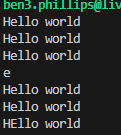

# ASP_worksheet1

## Task 1

For task 1 I implemented a my_string class and you can find it in the 'my_string.hpp' file. This class contains a pointer to a string as a variable, a default and a normal constructor, a copy constructor, an overloaded assignment operator, and a destructor. It also contains functions to get and set characters from the string, a print function to print the entire string, and get function that would get the length of the string. Some of the function bodies that were only one line are defined here, whereas the rest of them I placed in the 'my_string.cpp' file.
```c++
class my_string
{
private:
    char *pStr;
public:
    my_string() : pStr(nullptr) {}    //default constructor
    my_string(const char* s);         //normal constructor
    my_string(const my_string& s) : pStr(s.pStr) {} //copy constructor
    my_string& operator=(const my_string& s);       //assignment operator overload
    ~my_string();                   //destructor
    
    char getChar(const int& i);
    void setChar(const int& i, const char& c);
    void print() const;

    int getLength(const char* str) const;
};
```

<br/>

If the default constructor is called then a null pointer is assigned, whereas if the normal constructor is called then it will allocate memory equal to the length of the characters  of the passed parameter for the pStr variable. Then it will copy each letter from the parameter passed to the pStr variable, as you can see below.
```c++
my_string::my_string(const char* s)
{
    pStr = new char[getLength(s)]; //allocate memory for pointer
    //sets each character
    for (int i = 0; i < getLength(s); i++){
        pStr[i] = s[i];
    }
}
```

<br/>

The copy constructor will be called when a my_string object is created and assigned to an existing my_string object. It copies the pStr pointer from the existing object that is passed as the parameter and assigns it to the pStr pointer for this object that is created.

The overload assignment operator will be called when an existing object of my_string is assigned to another. If the objects are the same or have the same reference to their pStr variable then it wil return the object and nothing will happen. Otherwise the pStr reference will be copied over and the object will be returned.
```c++
// overload assignment operator
my_string& my_string::operator=(const my_string& s)
{
    // if object is the same or pointing to the same allocated data
    if (&s == this || s.pStr == pStr) {
        return *this; 
    }

    pStr = s.pStr; //copy reference
    return *this;
} 
```

<br/>

The getChar and setChar functions will return the character or change the character at the specified index.
```c++
char my_string::getChar(const int& i)
{
    assert(i < getLength(pStr));
    return pStr[i];
}

void my_string::setChar(const int& i, const char& c)
{
    assert(i < getLength(pStr));
    pStr[i] = c;
}
```

<br/>

The print function will iterate over each character in pStr and print it to the console.
```c++
void my_string::print() const
{
    //print each character to console
    for (int i = 0; i < getLength(pStr); i++){
        cout << pStr[i];
    }
    cout << endl;
}
```

<br/>

I also have a getLength function to determine the length of the string. This will take a char pointer as a parameter and iterate over each character until a null character is reached. It will increment a variable each time and return the resulting length.
```c++
int my_string::getLength(const char* s) const
{
    if (s == 0) { return 0; }

    int i;
    //increment i until null character is reached
    for (i = 0; s[i] != '\0'; i++) { /* do nothing */ }
    return i;
}
```

<br/>

I then created another file 'test_string.cpp' and in the main function I tested the my_string class using the code below.
```c++
my_string s("Hello world");
s.print();
{
    my_string t = s;
    s.print();
    t.print();
    cout << s.getChar(1) << endl;
    s.print();
    t.print();
}
s.setChar(1,'E');
s.print();
```

<br/>

You can see the output of this running below.




## Task 2

For task 2 I added functionality to track the reference count of a my_string object. To do this I added an integer pointer variable called pRefCount that will be used to keep track. In the default and normal constructors it will now allocate memory for pRefCount and set the value to one. For the copy constructor the reference to the pRefCount will now be copied as well as the pStr reference and then pRefCount will be incremented.
```c++
class my_string
{
private:
    char *pStr;
    int *pRefCount;
public:
    my_string() : pStr(nullptr), pRefCount(new int(1)) {}  //default constructor
    my_string(const char* s);  //normal constructor
    my_string(const my_string& s) : pStr(s.pStr), pRefCount(s.pRefCount) { *pRefCount += 1; }  //copy constructor
    my_string& operator=(const my_string& s);  //assignment operator overload
    ~my_string();
    
    char getChar(const int& i);
    void setChar(const int& i, const char& c);
    void print() const;

    int getLength(const char* str) const;
};
```

Below is the line of code I added to the normal constructor.
```c++
pRefCount = new int(1); //allocated memory for ref count pointer and set to 1
```

<br/>

For the overload assignment operator I added functionality so that if the pStr is currently pointing at a different reference, then the reference count will first be decremented as it is going to be reassigned. After this it will check if the reference count is 0 and if it is then it will free the memory for pRefCount and pStr. Then it will copy the reference to pRefCount and pStr and increment the reference count.
```c++
my_string& my_string::operator=(const my_string& s)
{
    // if object is the same or pointing to the same allocated data
    if (&s == this || s.pStr == pStr) {
        return *this;
    }

    // if object is pointing to different allocated data
    if (s.pStr != pStr) {
        *pRefCount -= 1;
        //if there are no references to the object then the memory can be freed
        if (*pRefCount == 0) { 
            delete pRefCount;
            delete pStr;
        }
    }

    //copy and increment reference count
    pRefCount = s.pRefCount;
    *pRefCount += 1;

    pStr = s.pStr; //copy reference
    return *this;
} 
```

<br/>

I have also implemented the destructor. This will decrement the reference count when it is called and free up the memory if there are no references left.
```c++
my_string::~my_string()
{
    assert(*pRefCount > 0);

    *pRefCount -= 1;

    //if there are no references to the object then free the memory
    if (*pRefCount == 0) {
        delete pRefCount;
        delete pStr;
    }
}
```

<br/>

To be able to display the reference count I have also changed the last line of code in my print function.
```c++
cout << " [" << *pRefCount << "]" << endl;
```

<br/>

Now when I run my program it will display the reference count of the object. Below you can see the output using the same code from task 1.


## Task 3

For this task I added functionality to show when there is a reference count of 0. In the overload assignment operator I added code to show if an object was reassigned and used my print function to show if it now had a reference count of 0. I also added code to show if it was the same object or had the same reference.
```c++
my_string& my_string::operator=(const my_string& s)
{
    // if object is the same or pointing to the same allocated data
    if (&s == this || s.pStr == pStr) {
        cout << "Same reference" << endl;
        return *this;
    }

    // if object is pointing to different allocated data
    if (s.pStr != pStr) {
        cout << "Reassigned" << endl;
        *pRefCount -= 1;
        //if there are no references to the object then the memory can be freed
        if (*pRefCount == 0) {
            print();
            delete pRefCount;
            delete pStr;
        }
    }

    //copy and increment reference count
    pRefCount = s.pRefCount;
    *pRefCount += 1;

    pStr = s.pStr; //copy reference
    return *this;
} 
```

<br/>

In the destructor I also added code to show when the destructor was called and then my print function would be called if it now had a reference count of 0.
```c++
my_string::~my_string()
{
    cout << "Destructor called" << endl;

    assert(*pRefCount > 0);

    *pRefCount -= 1;
    //if there are no references to the object then free the memory
    if (*pRefCount == 0) {
        print();
        delete pRefCount;
        delete pStr;
    }
}
```

<br/>

To show this, I first used the same code from before. You can see the output below.


<br/>

Then I changed the code a bit to test the rest of it.
```c++
my_string s("First object");
s.print();
{
    my_string t("Second object");
    s.print();
    t.print();
    s = t;
    s.print();
    t.print();
    s = s;
    s = t;
}
s.print();
```

<br/>

This was the output.


## Task 4

For task 4 I implemented a template class that can be used by any type to reference count. This can be found in the ref_counter.hpp file. It has 2 pointer variables; pRefCount to track the count and pType for the pointer to the type that is passed in. The code for the constructors and the assignment operator overload is the same or very similar to the reference counting code from the my_string class. The only real difference is the normal constructor that just takes a pointer and assigns pType to it. This would however mean that when creating a new ref_count you would have to pass in a pointer for the type, but it is likely better than constructing inside the class as you would need to pass in many more parameters for creating the type.
```c++
ref_counter(T* t) : pRefCount(new int(1)), pType(t) {}  // normal constructor
```

<br/>

I also overloaded the dereference and member access operators to make it easier to directly access the type that is contained in the ref_counter object.
```c++
T& operator*() { return *pType; }  // dereference operator overload
T* operator->() { return pType; }  // member access operator overload
```

<br/>

In the test_string.cpp file I tested the ref_counter class using some different types. Below you can see the code I used and the output.
```c++
ref_counter<int> i(new int(55));
cout << *i << endl;

ref_counter<string> str(new string("String"));
cout << *str << endl;

ref_counter<my_string> my_str(new my_string("Hello world"));
my_str->print();
```


<br/>

I first tested the ref_counter class some more using the int type.
```c++
ref_counter<int> i(new int(55));
cout << *i;
i.printRefCount();
{
    ref_counter<int> j(new int(10));
    cout << *j;
    j.printRefCount();
    {
        ref_counter<int> k = j;
        cout << *k;
        k.printRefCount();
        cout << *j;
        j.printRefCount();
    }
    cout << *j;
    j.printRefCount();
    j = j;
    j = i;
    cout << *i;
    i.printRefCount();
    cout << *j;
    j.printRefCount();
}
cout << *i;
i.printRefCount();
*i = 40;
cout << *i;
i.printRefCount();
```


<br/>

I then removed all the reference counting functionality from the my_string class as it will all be done by the ref_counter class. Then I reworked the tests I used before for my_string so they could be used for a my_string reference counted object. For better looking output I commented out the 'cout << endl' at the end of the my_string print function so you can see the reference count on the same line.
```c++
ref_counter<my_string> s(new my_string("Hello world"));
s->print();
cout << " [" << s.getRefCount() << "]" << endl;
{
    ref_counter<my_string> t = s;
    s->print();
    s.printRefCount();
    t->print();
    t.printRefCount();
    cout << s->getChar(1) << endl;
    s->print();
    s.printRefCount();
    t->print();
    t.printRefCount();
}
s->setChar(1, 'E');
s->print();
s.printRefCount();
```


<br/>

And here is the second my_string test reworked.
```c++
ref_counter<my_string> s(new my_string("First object"));
s->print();
s.printRefCount();
{
    ref_counter<my_string> t(new my_string("Second object"));
    s->print();
    s.printRefCount();
    t->print();
    t.printRefCount();
    s = t;
    s->print();
    s.printRefCount();
    t->print();
    t.printRefCount();
    s = s;
    s = t;
}
s->print();
s.printRefCount();
```

